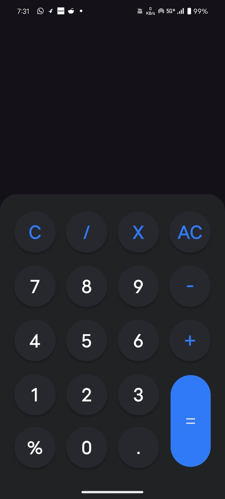
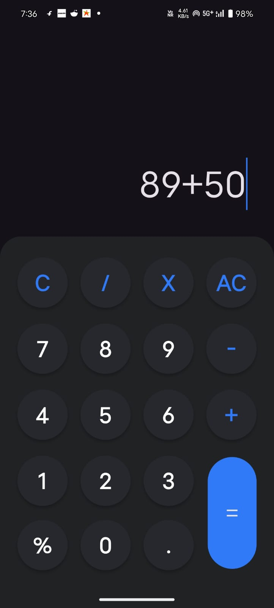

# 🖩 Calculator App

🚀 A simple and elegant calculator built using **Flutter**. This app provides a clean UI and smooth functionality to perform basic arithmetic operations.

---

## 📱 Features
✅ **User-Friendly Interface** – Minimalist and smooth UI  
✅ **Basic Operations** – Addition, Subtraction, Multiplication, Division
✅ **Lightweight & Fast** – Runs smoothly on all devices  

---

## 🛠️ Tech Stack
- **Flutter** (Dart)
- **Provider** (State Management)
- **Function Tree** (Math Expression Parsing)
- **Material Design** (UI)

---

## 🚀 Getting Started
### 📌 Prerequisites
Make sure you have the following installed:
- ✅ [Flutter SDK](https://flutter.dev/docs/get-started/install)  
- ✅ [Dart](https://dart.dev/get-dart)  
- ✅ [VS Code](https://code.visualstudio.com/) or Android Studio  

### 🔧 Installation
Clone this repository and run the app:
```sh
git clone https://github.com/sandeshtukrul/Calculator.git
cd Calculator
flutter pub get
flutter run

```

# 🖩 Calculator App

🚀 A simple and elegant calculator built using **Flutter**.  

---

## 🎨 Screenshots
| 📱 Demo 1 | 📱 Demo 2 | 📱 Demo 3 |
|----------- |-----------|----------- |
|  |  | 

---

## 💡 How It Works
1️⃣ Enter numbers using the keypad  
2️⃣ Use the `+`, `-`, `×`, and `/` buttons for operations  
3️⃣ Press `=` to get the result  
4️⃣ Use `AC` to clear the input  

---

## 🛠️ Contributing
Contributions are welcome!  
🔹 Fork this repository  
🔹 Create a new branch (`git checkout -b feature-name`)  
🔹 Commit your changes (`git commit -m "Add new feature"`)  
🔹 Push to the branch (`git push origin feature-name`)  
🔹 Open a **Pull Request**  

---

## 📜 License
📄 This project is licensed under the **MIT License** – see the [LICENSE](LICENSE) file for details.

---

## 📞 Contact
👨‍💻 **Sandesh Tukrul**  
📧 [Email](tukrulsandesh@gmail.com)  
🔗 [GitHub Profile](https://github.com/sandeshtukrul)

---

⭐ **If you like this project, consider giving it a star!** ⭐  
